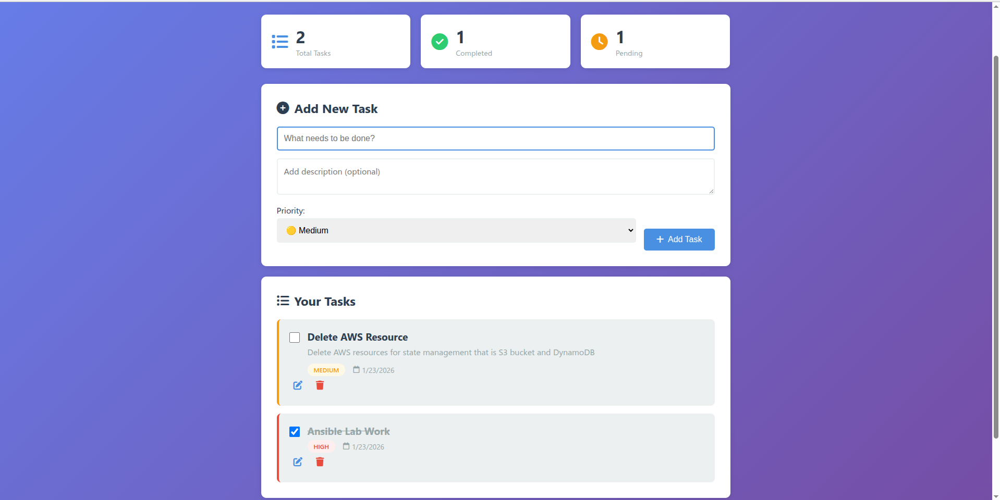
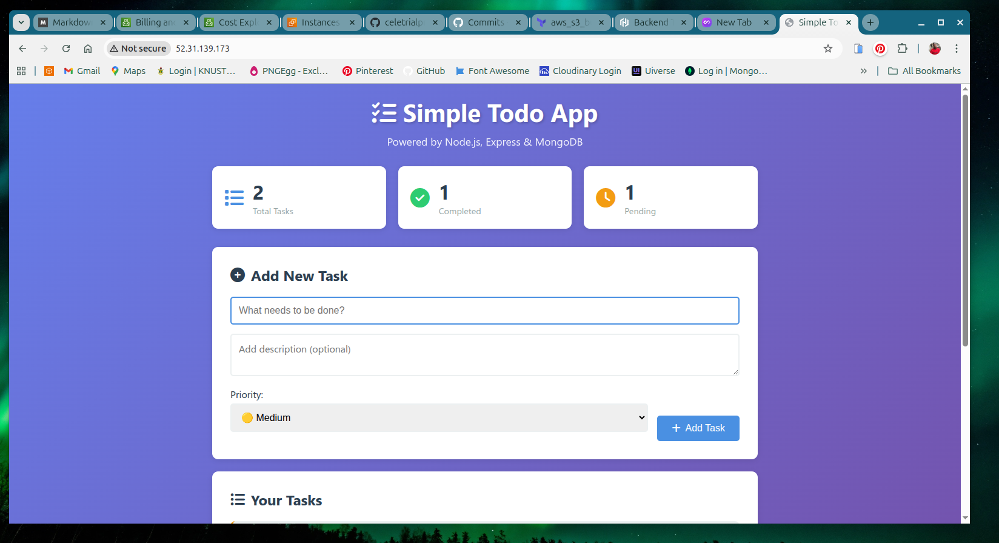

# Deploy and Configure Web App (Terraform + Ansible)

> **DevOps Project**: Automated Infrastructure Provisioning and Application Deployment using Infrastructure as Code (IaC) and Configuration Management

## 📋 Project Overview

This project demonstrates a complete DevOps workflow for deploying a Node.js Todo application on AWS using:
- **Terraform** for infrastructure provisioning (IaC)
- **Ansible** for configuration management and application deployment
- **AWS EC2** for hosting
- **MongoDB** for database
- **Nginx** as reverse proxy
- **Systemd** for process management

## 🏗️ Architecture

```
┌─────────────────────────────────────────────┐
│            AWS Cloud (EC2)                  │
│  ┌───────────────────────────────────────┐  │
│  │  Amazon Linux 2023 Instance           │  │
│  │  ┌─────────────────────────────────┐  │  │
│  │  │   Nginx (Port 80)               │  │  │
│  │  │   Reverse Proxy                 │  │  │
│  │  └──────────┬──────────────────────┘  │  │
│  │             │                          │  │
│  │  ┌──────────▼──────────────────────┐  │  │
│  │  │   Node.js App (Port 3000)       │  │  │
│  │  │   Todo Application              │  │  │
│  │  └──────────┬──────────────────────┘  │  │
│  │             │                          │  │
│  │  ┌──────────▼──────────────────────┐  │  │
│  │  │   MongoDB (Port 27017)          │  │  │
│  │  │   Database                      │  │  │
│  │  └─────────────────────────────────┘  │  │
│  └───────────────────────────────────────┘  │
└─────────────────────────────────────────────┘
```

## 📁 Project Structure

```
Deploy&Configure_Web_App/
├── Terraform/              # Infrastructure as Code
│   ├── main.tf            # Root module configuration
│   ├── provider.tf        # AWS provider configuration
│   ├── variable.tf        # Input variables
│   ├── output.tf          # Output values
│   ├── inventory.tpl      # Ansible inventory template
│   ├── Network/           # VPC, Subnet, IGW, Route Table
│   ├── Security/          # Security Groups
│   └── Compute/           # EC2 Instance, SSH Keys
├── Ansible/               # Configuration Management
│   ├── site.yml           # Main playbook
│   ├── inventory.ini      # Auto-generated from Terraform
│   └── ansible.cfg        # Ansible configuration
├── webapp/                # Node.js Todo Application
│   ├── server.js          # Express server
│   ├── models/            # MongoDB models
│   ├── routes/            # API routes
│   ├── views/             # EJS templates
│   └── public/            # Static assets
└── Assets/                # Project screenshots
```

## 🚀 Deployment Workflow

### Phase 1: Infrastructure Provisioning (Terraform)

1. **Initialize Terraform**
   ```bash
   cd Terraform
   terraform init
   ```

2. **Review Infrastructure Plan**
   ```bash
   terraform plan
   ```

3. **Provision AWS Resources**
   ```bash
   terraform apply -auto-approve
   ```

**What Terraform Creates:**
- ✅ VPC with public subnet
- ✅ Internet Gateway and Route Table
- ✅ Security Group (ports: 22, 80, 3000, 27017)
- ✅ EC2 Instance (Amazon Linux 2023)
- ✅ SSH Key Pair for access
- ✅ Auto-generated Ansible inventory file

### Phase 2: Application Deployment (Ansible)

1. **Verify Connectivity**
   ```bash
   cd ../Ansible
   ansible webservers -m ping
   ```
   OR
   ```bash
   cd ../Ansible
   ansible-playbook test-playbook.yml
   ```

2. **Deploy Application**
   ```bash
   ansible-playbook site.yml
   ```

**What Ansible Configures:**
- ✅ System package updates
- ✅ MongoDB 7.0 installation and configuration
- ✅ Node.js 20 installation
- ✅ Git installation and repository cloning
- ✅ Application dependencies installation
- ✅ Environment configuration (.env file)
- ✅ Systemd service creation
- ✅ Nginx reverse proxy setup
- ✅ Service startup and health checks

## 🖼️ Application Screenshots

### Web Application Interface

*Main dashboard showing todo list with create, update, and delete functionality*


*Task management with priority levels and completion status*

### Deployment Process

*Ansible playbook execution and configuration management*


*Successful deployment with all services running*


*Live application accessible via Nginx reverse proxy*

## 🛠️ Technologies Used

### Infrastructure & DevOps
- **Terraform** v1.x - Infrastructure as Code
- **Ansible** v2.x - Configuration Management
- **AWS EC2** - Cloud Computing
- **Amazon Linux 2023** - Operating System

### Application Stack
- **Node.js** v20 - JavaScript Runtime
- **Express.js** - Web Framework
- **MongoDB** v7.0 - NoSQL Database
- **Mongoose** - MongoDB ODM
- **EJS** - Template Engine
- **Nginx** - Web Server/Reverse Proxy

### System Services
- **Systemd** - Service Management
- **YUM** - Package Manager
- **Git** - Version Control

## 📊 Features

### Infrastructure Features
- ✅ Modular Terraform structure (Network, Security, Compute)
- ✅ Automated inventory generation
- ✅ Idempotent configuration management
- ✅ Security group with least privilege access
- ✅ Automated SSH key generation

### Application Features
- ✅ Full CRUD operations for todos
- ✅ Task prioritization (Low/Medium/High)
- ✅ Completion status tracking
- ✅ Responsive web interface
- ✅ REST API endpoints
- ✅ MongoDB persistence
- ✅ Production-ready systemd service
- ✅ Nginx reverse proxy with proper headers
- ✅ Health check endpoint

## 🔐 Security Considerations

- SSH access via key-based authentication only
- Security group rules restrict access to specific ports
- Private key stored locally with 0400 permissions
- MongoDB bound to localhost only
- Application runs as non-root user
- Nginx handles external traffic (port 80)
- Node.js app isolated on port 3000

## 📝 Configuration Files

### Key Terraform Files
- **main.tf** - Module orchestration and inventory generation
- **inventory.tpl** - Template for Ansible inventory
- **Network/main.tf** - VPC, Subnet, IGW, Route Table
- **Security/main.tf** - Security Group rules
- **Compute/main.tf** - EC2 instance and SSH keys

### Key Ansible Files
- **site.yml** - Complete deployment playbook
- **inventory.ini** - Auto-generated from Terraform outputs
- **ansible.cfg** - Ansible behavior configuration

## 🔄 Auto-Generated Inventory

The project includes automated inventory file generation:

```yaml
# Terraform automatically creates inventory.ini with:
resource "local_file" "ansible_inventory" {
  content = templatefile("${path.module}/inventory.tpl", {
    instance_ip         = module.compute.instance_public_ip
    ansible_user        = "ec2-user"
    private_key_path    = module.compute.private_key_path
    python_interpreter  = "/usr/bin/python3"
  })
  filename = "${path.module}/../Ansible/inventory.ini"
}
```

**Benefits:**
- No manual copying of IP addresses
- Always synchronized with infrastructure
- Single source of truth (Terraform outputs)
- Works seamlessly with `terraform destroy` and recreate

## 🧪 Testing & Verification

### Infrastructure Testing
```bash
# Verify Terraform resources
terraform show

# Check outputs
terraform output
```

### Application Testing
```bash
# SSH into instance
ssh -i Terraform/Compute/AnsibleKeyPair.pem ec2-user@<instance-ip>

# Check Node.js service
sudo systemctl status todoapp

# Check MongoDB service
sudo systemctl status mongod

# Check Nginx service
sudo systemctl status nginx

# View application logs
sudo journalctl -u todoapp -f
```

### Health Check
```bash
# Test application endpoint
curl http://<instance-ip>/health

# Access web interface
curl http://<instance-ip>
```

## 🗑️ Cleanup

To destroy all resources:

```bash
cd Terraform
terraform destroy -auto-approve
```

This will remove:
- EC2 instance
- Security group
- SSH key pair
- VPC and networking components
- All associated AWS resources

## 📚 Learning Outcomes

This project demonstrates proficiency in:
- ✅ Infrastructure as Code (IaC) with Terraform
- ✅ Configuration Management with Ansible
- ✅ AWS cloud services (EC2, VPC, Security Groups)
- ✅ Linux system administration
- ✅ Web application deployment
- ✅ Reverse proxy configuration
- ✅ Service management with systemd
- ✅ DevOps best practices
- ✅ Automation and scripting

## 🎯 Project Requirements Met

- [x] **Part 1**: Terraform infrastructure provisioning
  - VPC, Subnet, Internet Gateway, Route Table
  - Security Group with proper rules
  - EC2 instance creation
  - SSH key pair generation
  - Modular code structure
  
- [x] **Part 2**: Ansible configuration management
  - MongoDB installation and configuration
  - Node.js and npm installation
  - Application deployment from GitHub
  - Nginx reverse proxy setup
  - Systemd service creation
  - Automated inventory generation

- [x] **Part 3**: Documentation and evidence
  - Complete README with architecture
  - Screenshots of deployment process
  - Running application screenshots
  - Code documentation and comments

## 📄 License

This project is for educational purposes as part of a DevOps training assignment.

---

**Note**: Remember to destroy infrastructure after testing to avoid unnecessary AWS charges:
```bash
cd Terraform && terraform destroy -auto-approve
```
